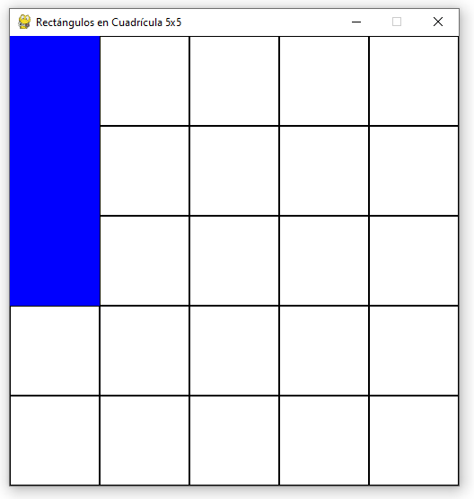

# Rects in a Grid 0.1.0


## ¿ Cuántos rectángulos caben en una cuadrícula de 5 x 5 ?

## Recursos
Se usará **pygame** para la visualización

## Descripción
Dada una cuadrícula de 5 x 5, el programa crea todos los posibles rectángulos permutando un rango de números de 1 a 5 en combinaciones de 2.

Cada rectángulo se posiciona en la casilla superior izquierda y se va desplazando de 1 en 1 casilla hasta completar todo el recorrido por la cuadrícula.

Cada movimiento es registrado en un contador.

Al final de todos los recorridos el contador devolverá el número de rectángulos posibles dentro de la cuadrícula.



## Uso
Para ejecutar la aplicación, ejecuta el archivo **.exe** haciendo doble clic. Esto abrirá una cuadrícula por defecto de 5x5.

Si quieres personalizar la cuadrícula, abre una consola y ejecuta el archivo pasándole el argumento size.

Ejemplo en **bash**:

```sh
$ ./rectsingrid.exe --size 8
```

De momento el tamaño está limitado entre 2 y 10. Obviamente una cuadrícula de 1 no tiene rectángulos posibles.

## Updates
Se añade la posibilidad de adaptar la cuadrícula a la dimensión que se quiera (cuadrada)

Se ha empaquetado la aplicación para que pueda recibir argumentos con consola al ejecutar el archivo principal

## Posibles mejoras
Posibilidad de personalizar la velocidad de avance de los rectángulos

Posibilidad de personalizar colores de rectángulos